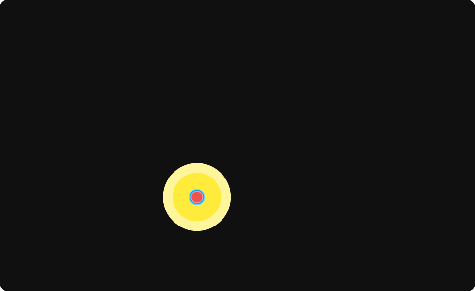

# `solar-system`

`solar-system` is a distributed model of the **sol system**  
It is implemented as a system of containerised microservices representing orbital bodies and gravitational interactions.  

Probes within the system can be configured via either the included **CLI** or the REST **API**.  

